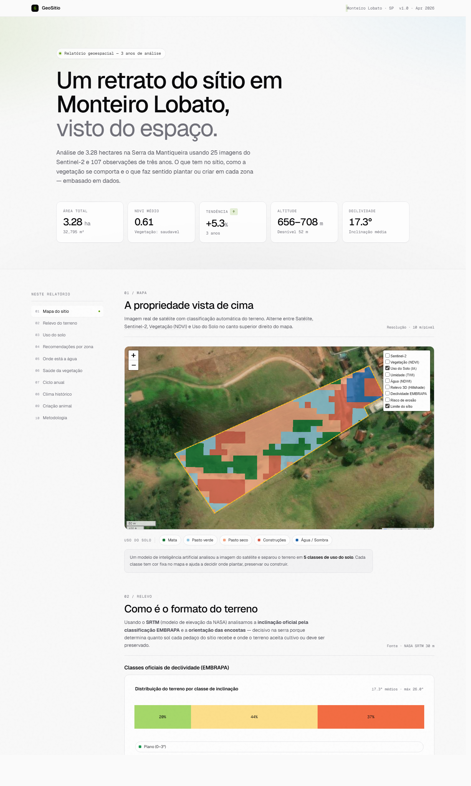

# GeoSítio

**Inteligência geoespacial aplicada a uma propriedade rural.**

Análise completa de um sítio de **3,28 ha** na Serra da Mantiqueira (Monteiro Lobato, SP) a partir de imagens de satélite, modelos de elevação e dados climáticos públicos. Tudo consolidado em um **dashboard HTML estático** de 10 seções.

[](https://rbateli.github.io/geositio-monteiro-lobato/)
[](LICENSE)
[](https://www.python.org/)
[](https://earthengine.google.com/)

**Demo ao vivo:** [rbateli.github.io/geositio-monteiro-lobato](https://rbateli.github.io/geositio-monteiro-lobato/)



---

## O que faz

- **10 seções analíticas** — mapa, relevo, uso do solo, água, vegetação, ciclo sazonal, clima, recomendações por zona
- **8 camadas de satélite exclusivas** com legendas dinâmicas (Sentinel-2, NDVI, Uso do Solo via K-Means, TWI, NDWI, Hillshade, Declividade EMBRAPA, Risco de Erosão)
- **Série temporal NDVI** de 3 anos (~120 medições) e **clima histórico** 2015–2024 (CHIRPS + ERA5-Land)
- **Cruzamento NDVI × chuva** com cálculo de correlação em lag 0/1/2 meses
- **Recomendações práticas por zona** — onde plantar, onde pastorear, onde construir, onde fazer o tanque

## Stack

| Camada | Ferramentas |
|---|---|
| Coleta de dados | Google Earth Engine (Sentinel-2, SRTM, CHIRPS, ERA5-Land) |
| Processamento | GeoPandas, Rasterio, Shapely, NumPy, Pandas |
| ML | K-Means não supervisionado (via Earth Engine) |
| Visualização | Plotly.js, Leaflet (via Folium), HTML/CSS puro |
| Design | Geist + Geist Mono · paleta zinc + lime-600 |

## Como rodar

```bash
git clone https://github.com/rbateli/geositio-monteiro-lobato.git
cd geositio-monteiro-lobato

python -m venv .venv
.venv\Scripts\activate          # Windows
source .venv/bin/activate       # Linux/Mac

pip install -r requirements.txt

# Autenticar no Earth Engine (uma vez por máquina)
earthengine authenticate

# Gerar o site (~2 min, depende da rede)
python gerar_site.py

# Abrir
start data/sitio.html           # Windows
open data/sitio.html            # Mac
xdg-open data/sitio.html        # Linux
```

> **Nota:** os tiles do Earth Engine expiram em ~24 h. Pra renovar, basta rodar `python gerar_site.py` de novo.

## Fontes de dados

| Dataset | Resolução | Origem |
|---|---|---|
| **Sentinel-2** (RGB, NDVI) | 10 m | ESA via GEE |
| **SRTM** (elevação, declividade, aspecto) | 30 m | NASA via GEE |
| **CHIRPS** (precipitação) | 5 km | UCSB via GEE |
| **ERA5-Land** (temperatura) | 11 km | ECMWF via GEE |
| **Esri World Imagery** (basemap) | — | tiles |

## Estrutura

```
gerar_site.py            # Pipeline de build (10 etapas)
src/
  config.py              # Centro do sítio, paths
  geo_utils.py           # Carregamento da geometria (KML)
  ee_utils.py            # Earth Engine: paletas, séries, classificação
notebooks/               # Exploração módulo a módulo
  01_mapeamento_interativo.ipynb
  02_ndvi_vegetacao.ipynb
  03_relevo_declividade.ipynb
design-system/
  MASTER.md              # Documentação do sistema visual
data/
  Sítio Monteiro Lobato.kml
  thumb_agua.png         # Thumbnail curado da seção Água
  ndvi_serie_temporal.csv
  sitio.html             # Artefato gerado (gitignored, ~14 MB)
docs/
  screenshot.png         # Captura usada neste README
```

## Decisões técnicas

- **HTML estático em vez de Streamlit.** Testado, descartado: a UX do Streamlit não acompanha o nível visual desejado.
- **Tiles do Earth Engine** servidos via URL temporária — não há export pesado. Trade-off: regeneração diária; ganho: build em 2 min.
- **CRS dual.** EPSG:4326 (WGS84) pra exibição, EPSG:31983 (SIRGAS 2000 / UTM 23S) pra análise métrica.
- **Datasets climáticos amostrados no centróide** — CHIRPS (5 km) e ERA5-Land (11 km) são maiores que o sítio (180 m); usar a geometria retorna NaN.

## Roadmap

- [x] **Deploy público** — [GitHub Pages](https://rbateli.github.io/geositio-monteiro-lobato/) (rebuild manual via `bash deploy.sh`)
- [ ] **MapBiomas** (38 anos de uso do solo) — mostra evolução do sítio
- [ ] **CAR** (Cadastro Ambiental Rural) — confirmar reserva legal oficial
- [ ] **GitHub Actions** — rebuild diário automatizado pra manter os tiles do Earth Engine vivos

## Autor

**Rafael Bateli de Medeiros**
[LinkedIn](https://www.linkedin.com/in/rafael-bateli/) · [rafael.bateli@gmail.com](mailto:rafael.bateli@gmail.com)

## Licença

[MIT](LICENSE)
